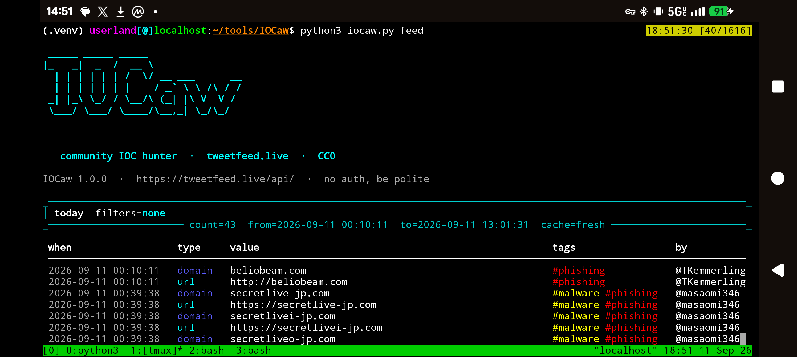

# IOCaw

```
 _____ _____ _____                
|_   _|  _  /  __ \               
  | | | | | | /  \/ __ ___      __
  | | | | | | |    / _` \ \ /\ / /
 _| |_\ \_/ / \__/\ (_| |\ V  V / 
 \___/ \___/ \____/\__,_| \_/\_/  
                                  
                                  
```

**IOCaw** (*eye-caw*) is a colorful command-line hunter for the public
[TweetFeed.live](https://tweetfeed.live) API. TweetFeed collects indicators of
compromise that infosec researchers share on X/Twitter — phishing and scam
URLs, malware-delivery domains, C2 IPs, file hashes — and republishes them
every 15 minutes under **CC0**. No API key.

The data is community-sourced and **not independently verified**. This tool
queries the feed; it does not visit, execute, or confirm that anything listed
is malicious. Do not browse live IOC URLs from a normal browser.

API docs: https://tweetfeed.live/api/


### Preview
---



---

## Install

```bash
python3 -m pip install -r requirements.txt
chmod +x iocaw.py
```

Needs Python 3.10+, `requests`, and `rich`.

## Quick start

```bash
# today's phishing URLs, defanged so you can paste them
python3 iocaw.py feed today --tag phishing --type url --defang

# one indicator, plus AI context and registration metadata
python3 iocaw.py lookup beliobeam.com --defang

# this week's Cobalt Strike IPs
python3 iocaw.py feed week --tag CobaltStrike --type ip

# hashes from a specific researcher
python3 iocaw.py feed month --user malwrhunterteam --type sha256

# AI-clustered campaigns
python3 iocaw.py campaigns
python3 iocaw.py campaigns --id tfc-8405633d4c70 --defang

# movers, hot TLDs, novelty
python3 iocaw.py trends

# totals by window / type / tag
python3 iocaw.py counts
python3 iocaw.py counts week

# is the pipeline fresh?
python3 iocaw.py status

# 30-day domain blocklist (Pi-hole style)
python3 iocaw.py blocklist domains --limit 20 --defang

# follow new IOCs (polls /v1/since)
python3 iocaw.py watch --tag phishing --interval 90 --defang
```

## Commands

| Command | What it hits |
|---|---|
| `feed {today,week,month,year}` | `GET /v1/{window}/{filter}/{filter}` |
| `lookup VALUE` | `GET /v1/ioc?value=` (365-day exact match + enrichment) |
| `campaigns [--id]` | `GET /v1/campaigns` and `/v1/campaigns/{id}` |
| `trends` | `GET /v1/trends` |
| `counts [window]` | `GET /v1/counts` |
| `status` | `GET /v1/status` |
| `watch` | `GET /v1/since/{ISO8601}` on a loop |
| `blocklist KIND` | `GET /v1/blocklist/{kind}.txt` |

Filters (`--type`, `--tag`, `--user`) can be combined. Order does not matter.

### Handy flags

- `--defang` — `hxxps://` and `[.]` for safe pasting
- `--json` — raw JSON on stdout (pipe-friendly, no banner)
- `--export out.csv|out.json|out.txt` — save the result
- `--limit N` — cap printed rows (`0` = all)
- `--contains needle` — client-side substring filter after the fetch
- `--values-only` — print just the IOC values (good for blocklists)
- `--tweets` — also print the source tweet URLs
- `--quiet` — skip the ASCII banner

```bash
python3 iocaw.py feed week --type domain --tag scam --export scams.csv
python3 iocaw.py feed today --values-only --limit 0 > today.txt
python3 iocaw.py lookup 8.8.8.8 --json
```

`year` is special: the API 302s to a raw CSV of the last 365 days (no server-side
filters). IOCaw downloads it and applies `--type` / `--tag` / `--user` locally.

## Why the name

Crows notice shiny dangerous things and then **caw**. IOCaw does the same for
indicators of compromise.

## Etiquette

TweetFeed runs on a Cloudflare Worker with no auth and no hard per-key quota.
Be reasonable — `watch` defaults to 60s, which is plenty (the feed itself
refreshes every 15 minutes). Cloudflare 403s bare `Python-urllib` user-agents;
this client sends its own.

## License

This CLI is yours to reuse. The IOC data it prints is CC0 1.0 via TweetFeed.
Attribution to [tweetfeed.live](https://tweetfeed.live) is appreciated, not required.
